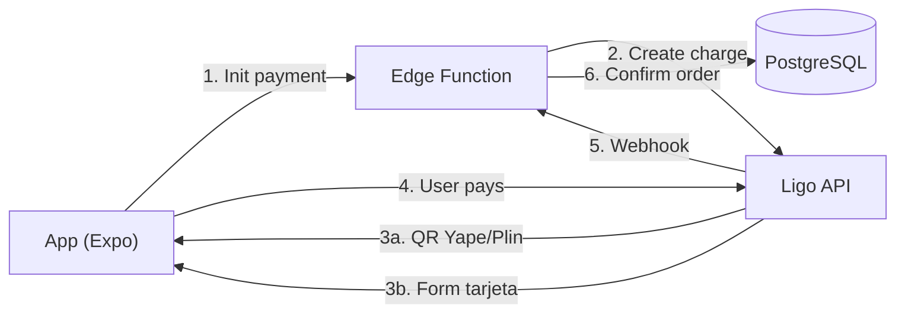

# ADR-004: Pasarela de pagos

## Estado

Propuesto — pendiente de validación comercial.

## Contexto

Necesitamos aceptar pagos en la app:
- **Yape** (app BCP, la más usada en Perú)
- **Plin** (interoperable entre bancos)
- **Tarjetas de crédito y débito** (Visa, Mastercard, Diners)

## Decisión

Usaremos **Ligo** como orquestador de pagos (propuesta).

### Alternativas evaluadas

| Opción | Yape/Plin | Tarjetas | Costo | Integración |
|---|---|---|---|---|
| **Ligo** | Sí | Sí (Visa, MC) | ~3.5% + S/.0.50 | API REST + Webhooks |
| **Culqi** | Sí (Yape vía QR) | Sí | ~3.9% | API REST + JS SDK |
| **Mercado Pago** | No (solo Argentina) | Sí | ~4.5% | API REST |
| **Niubiz** | No | Sí (Visa, MC) | ~3.2% | API SOAP (legado) |
| **Izipay** | No | Sí | Variable | API REST |

### Arquitectura de pagos

### Flujo Yape / Plin

1. App solicita QR a la Edge Function
2. Edge Function crea un cargo en Ligo con monto y concepto
3. Ligo devuelve un QR (Yape/Plin)
4. Usuario escanea con su app bancaria
5. Ligo envía webhook a nuestra Edge Function
6. Edge Function actualiza la orden como pagada

### Flujo Tarjeta

1. App muestra formulario de tarjeta (Ligo tokeniza)
2. Usuario ingresa datos → Ligo devuelve token
3. Edge Function cobra con el token
4. Ligo envía webhook con confirmación
5. Edge Function actualiza la orden

### Consecuencias

**Positivas:**
- Un solo orquestador para Yape, Plin y tarjetas
- Webhooks para confirmación asíncrona
- Tokenización de tarjetas (no manejamos datos sensibles)

**Negativas:**
- Comisión por transacción
- Dependencia de un tercero
- Necesita validación comercial (costos reales pueden variar)

**Requisitos:**
- Cuenta comercio en Ligo (o similar)
- Registro de la empresa (RUC)
- Certificación técnica con el proveedor
