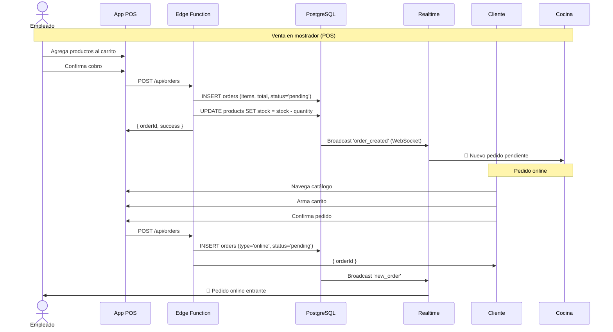
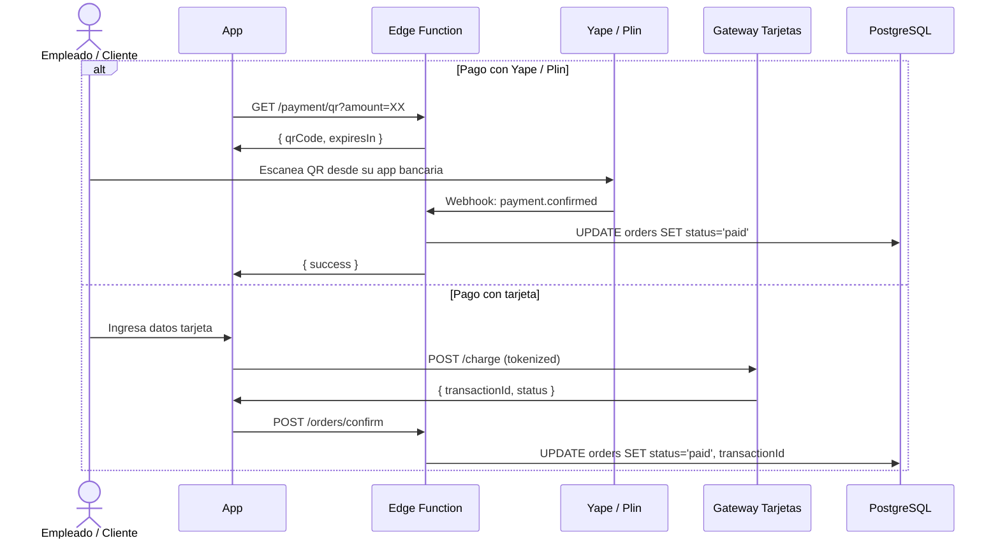
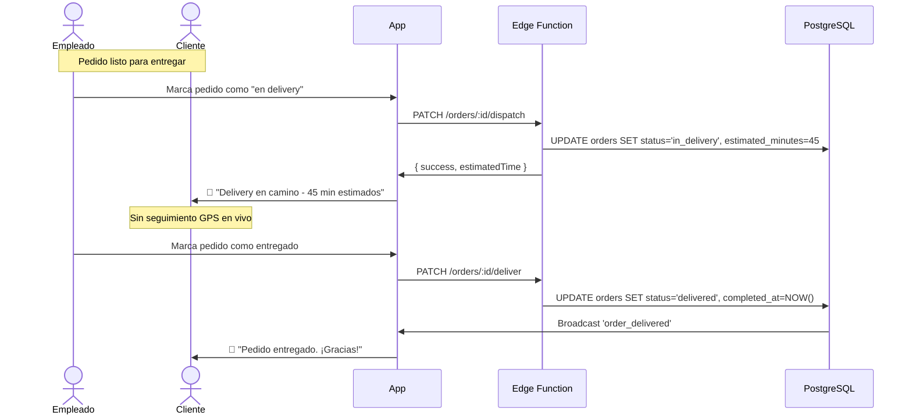

# Flujo de datos

## POS → BD → Realtime → Cliente

```mermaid
sequenceDiagram
    actor E as Empleado
    participant POS as App POS
    participant API as Edge Function
    participant DB as PostgreSQL
    participant R as Realtime
    participant C as Cliente
    participant K as Cocina

    Note over E,K: Venta en mostrador (POS)

    E->>POS: Agrega productos al carrito
    E->>POS: Confirma cobro
    POS->>API: POST /api/orders
    API->>DB: INSERT orders (items, total, status='pending')
    API->>DB: UPDATE products SET stock = stock - quantity
    API->>POS: { orderId, success }

    DB->>R: Broadcast 'order_created' (WebSocket)
    R->>K: 📢 Nuevo pedido pendiente

    Note over K,C: Pedido online

    C->>POS: Navega catálogo
    C->>POS: Arma carrito
    C->>POS: Confirma pedido
    POS->>API: POST /api/orders
    API->>DB: INSERT orders (type='online', status='pending')
    API->>C: { orderId }

    DB->>R: Broadcast 'new_order'
    R->>E: 📢 Pedido online entrante
```

## Flujo de pagos

```mermaid
sequenceDiagram
    actor E as Empleado / Cliente
    participant APP as App
    participant API as Edge Function
    participant Y as Yape / Plin
    participant GT as Gateway Tarjetas
    participant DB as PostgreSQL

    alt Pago con Yape / Plin
        APP->>API: GET /payment/qr?amount=XX
        API->>APP: { qrCode, expiresIn }
        E->>Y: Escanea QR desde su app bancaria
        Y->>API: Webhook: payment.confirmed
        API->>DB: UPDATE orders SET status='paid'
        API->>APP: { success }
    else Pago con tarjeta
        E->>APP: Ingresa datos tarjeta
        APP->>GT: POST /charge (tokenized)
        GT->>APP: { transactionId, status }
        APP->>API: POST /orders/confirm
        API->>DB: UPDATE orders SET status='paid', transactionId
    end
```

## Flujo de delivery

```mermaid
sequenceDiagram
    actor E as Empleado
    actor C as Cliente
    participant APP as App
    participant API as Edge Function
    participant DB as PostgreSQL

    Note over E,C: Pedido listo para entregar

    E->>APP: Marca pedido como "en delivery"
    APP->>API: PATCH /orders/:id/dispatch
    API->>DB: UPDATE orders SET status='in_delivery', estimated_minutes=45
    API->>APP: { success, estimatedTime }
    APP->>C: 📢 "Delivery en camino - 45 min estimados"

    Note over C: Sin seguimiento GPS en vivo

    E->>APP: Marca pedido como entregado
    APP->>API: PATCH /orders/:id/deliver
    API->>DB: UPDATE orders SET status='delivered', completed_at=NOW()
    DB->>APP: Broadcast 'order_delivered'
    APP->>C: 📢 "Pedido entregado. ¡Gracias!"
```
