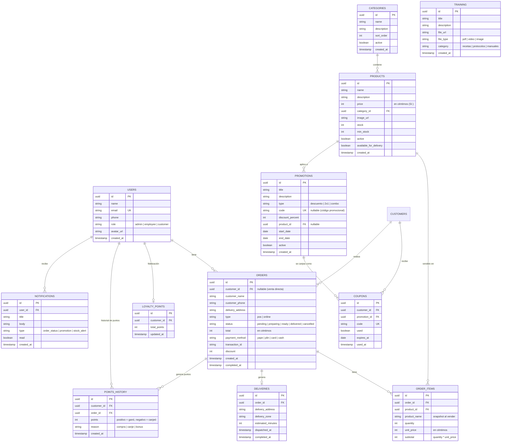

# Modelo Entidad-Relación

## Resumen de colecciones

| Colección | Propósito | ¿SQL? |
|---|---|---|
| `users` | Perfiles de usuario (todos los roles) | Postgres |
| `categories` | Categorías de productos | Postgres |
| `products` | Platillos del menú | Postgres |
| `orders` | Pedidos (POS + online) | Postgres |
| `order_items` | Detalle de cada pedido | Postgres |
| `deliveries` | Entrega a domicilio (sin GPS) | Postgres |
| `loyalty_points` | Puntos acumulados por cliente | Postgres |
| `points_history` | Movimientos de puntos | Postgres |
| `promotions` | Promociones activas | Postgres |
| `coupons` | Cupones asignados a clientes | Postgres |
| `training` | Materiales de capacitación | Postgres |
| `notifications` | Notificaciones push | Postgres |
