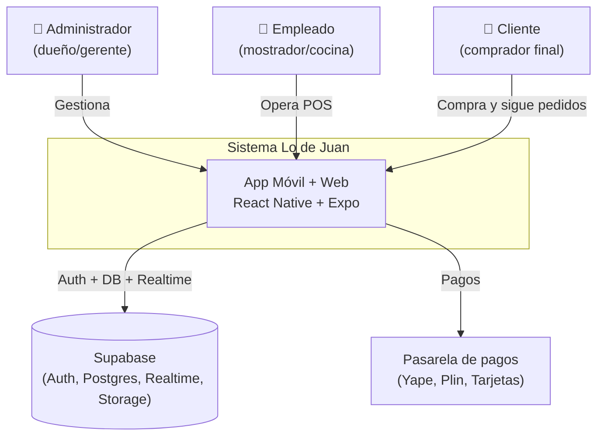
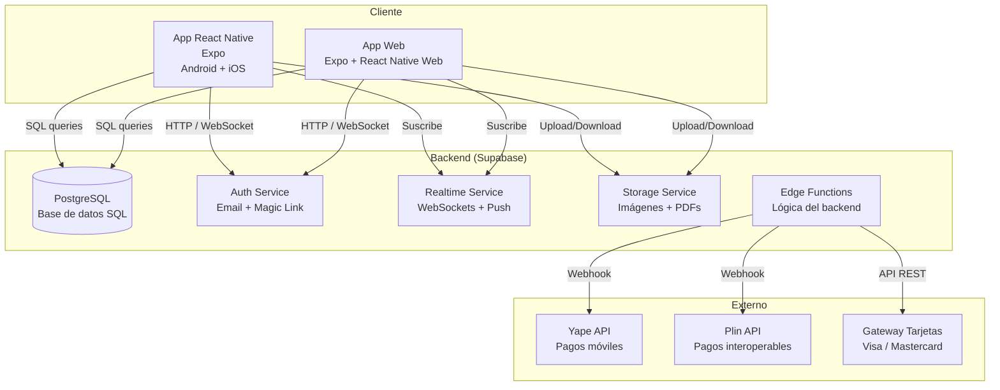

# Arquitectura general

## Diagrama de contexto (C4 Nivel 1)

## Diagrama de contenedores (C4 Nivel 2)

## Stack tecnológico

| Capa | Tecnología | Versión |
|---|---|---|
| **Frontend** | React Native + Expo | 0.81 / 54 |
| **Estilos** | NativeWind + Tailwind CSS | 4.2 / 3.4 |
| **Backend** | Supabase (PostgreSQL) | — |
| **Auth** | Supabase Auth | Email + Magic Link |
| **Base de datos** | PostgreSQL (Supabase) | — |
| **Realtime** | Supabase Realtime | WebSockets |
| **Storage** | Supabase Storage | Imágenes y PDFs |
| **Pagos** | Yape + Plin + Gateway | — |
