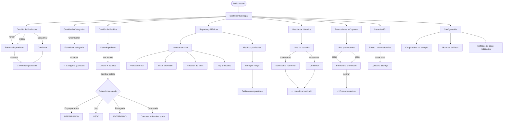

# Flujo — Administrador

```mermaid
flowchart TD
    START([Inicio sesión]) --> DASHBOARD[Dashboard principal]

    DASHBOARD --> GESTION_PRODUCTOS[Gestión de Productos]
    DASHBOARD --> GESTION_CATEGORIAS[Gestión de Categorías]
    DASHBOARD --> GESTION_PEDIDOS[Gestión de Pedidos]
    DASHBOARD --> REPORTES[Reportes y Métricas]
    DASHBOARD --> GESTION_USUARIOS[Gestión de Usuarios]
    DASHBOARD --> PROMOCIONES[Promociones y Cupones]
    DASHBOARD --> CAPACITACION[Capacitación]
    DASHBOARD --> CONFIGURACION[Configuración]

    GESTION_PRODUCTOS -->|Crear| FORM_PRODUCTO[Formulario producto]
    GESTION_PRODUCTOS -->|Editar| FORM_PRODUCTO
    GESTION_PRODUCTOS -->|Desactivar| CONFIRM_DESACTIVAR[Confirmar]
    FORM_PRODUCTO -->|Guardar| GUARDADO[✅ Producto guardado]
    CONFIRM_DESACTIVAR --> GUARDADO

    GESTION_CATEGORIAS -->|Crear/Editar| FORM_CATEGORIA[Formulario categoría]
    FORM_CATEGORIA -->|Guardar| CAT_GUARDADA[✅ Categoría guardada]

    GESTION_PEDIDOS --> LISTA_PEDIDOS[Lista de pedidos]
    LISTA_PEDIDOS -->|Ver detalle| DETALLE_PEDIDO[Detalle + estados]
    DETALLE_PEDIDO -->|Cambiar estado| ESTADOS{Seleccionar estado}
    ESTADOS -->|En preparación| PREPARANDO
    ESTADOS -->|Listo| LISTO
    ESTADOS -->|Entregado| ENTREGADO
    ESTADOS -->|Cancelado| CANCELADO_DEVUELVE[Cancelar + devolver stock]

    REPORTES --> MTRICAS[Métricas en vivo]
    REPORTES --> HISTORICO[Histórico por fechas]
    MTRICAS --> VENTAS_DIA[Ventas del día]
    MTRICAS --> TICKET_PROM[Ticket promedio]
    MTRICAS --> ROTACION[Rotación de stock]
    MTRICAS --> TOP_PRODUCTOS[Top productos]
    HISTORICO --> FILTRO_FECHA[Filtro por rango]
    FILTRO_FECHA --> GRAFICOS[Gráficos comparativos]

    GESTION_USUARIOS --> LISTA_USUARIOS[Lista de usuarios]
    LISTA_USUARIOS -->|Cambiar rol| CAMBIO_ROL[Seleccionar nuevo rol]
    LISTA_USUARIOS -->|Desactivar| DESACTIVAR_USUARIO[Confirmar]
    CAMBIO_ROL --> USUARIO_ACTUALIZADO[✅ Usuario actualizado]
    DESACTIVAR_USUARIO --> USUARIO_ACTUALIZADO

    PROMOCIONES --> LISTA_PROMOS[Lista promociones]
    LISTA_PROMOS -->|Crear| FORM_PROMO[Formulario promoción]
    LISTA_PROMOS -->|Editar| FORM_PROMO
    FORM_PROMO -->|Activar| PROMO_ACTIVA[✅ Promoción activa]

    CAPACITACION --> LISTA_MATERIALES[Subir / Listar materiales]
    LISTA_MATERIALES -->|Subir PDF| SUBIR_ARCHIVO[Upload a Storage]

    CONFIGURACION --> DATOS_EJEMPLO[Cargar datos de ejemplo]
    CONFIGURACION --> HORARIOS[Horarios del local]
    CONFIGURACION --> METODOS_PAGO[Métodos de pago habilitados]
```
