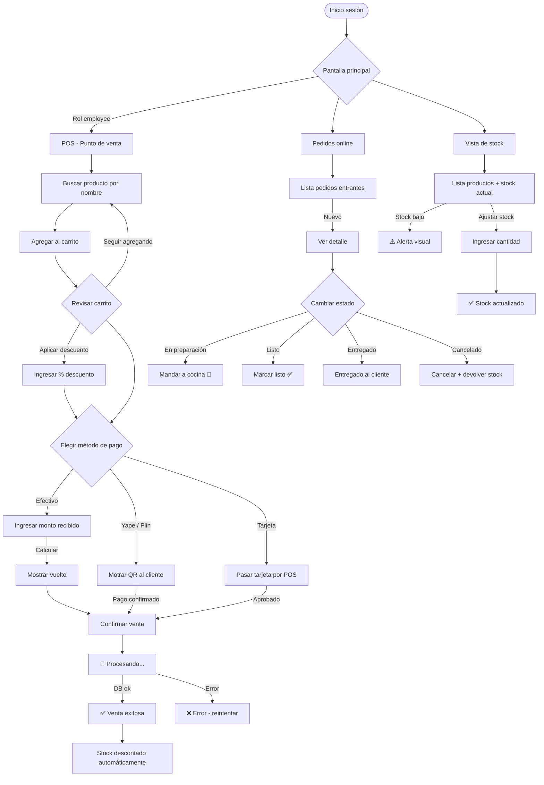

# Flujo — Empleado

```mermaid
flowchart TD
    START([Inicio sesión]) --> HOME{Pantalla principal}

    HOME -->|Rol employee| MODO_POS[POS - Punto de venta]
    HOME --> PEDIDOS_ONLINE[Pedidos online]
    HOME --> STOCK[Vista de stock]

    MODO_POS --> BUSCAR_PRODUCTO[Buscar producto por nombre]
    BUSCAR_PRODUCTO --> AGREGAR_CARRITO[Agregar al carrito]
    AGREGAR_CARRITO --> REVISAR_CARRITO{Revisar carrito}

    REVISAR_CARRITO -->|Seguir agregando| BUSCAR_PRODUCTO
    REVISAR_CARRITO -->|Aplicar descuento| DESCUENTO[Ingresar % descuento]
    DESCUENTO --> SELECCIONAR_PAGO

    REVISAR_CARRITO --> SELECCIONAR_PAGO{Elegir método de pago}

    SELECCIONAR_PAGO -->|Efectivo| EFECTIVO[Ingresar monto recibido]
    EFECTIVO -->|Calcular| VUELTO[Mostrar vuelto]
    VUELTO --> CONFIRMAR_VENTA[Confirmar venta]

    SELECCIONAR_PAGO -->|Yape / Plin| QR[Motrar QR al cliente]
    QR -->|Pago confirmado| CONFIRMAR_VENTA

    SELECCIONAR_PAGO -->|Tarjeta| LECTOR[Pasar tarjeta por POS]
    LECTOR -->|Aprobado| CONFIRMAR_VENTA

    CONFIRMAR_VENTA --> PROCESANDO[🔄 Procesando...]
    PROCESANDO -->|DB ok| VENTA_EXITOSA[✅ Venta exitosa]
    PROCESANDO -->|Error| ERROR[❌ Error - reintentar]
    VENTA_EXITOSA --> DESCONTAR_STOCK[Stock descontado automáticamente]

    PEDIDOS_ONLINE --> LISTA_PEDIDOS[Lista pedidos entrantes]
    LISTA_PEDIDOS -->|Nuevo| DETALLE[Ver detalle]
    DETALLE --> CAMBIAR_ESTADO{Cambiar estado}
    CAMBIAR_ESTADO -->|En preparación| COCINA[Mandar a cocina 🍳]
    CAMBIAR_ESTADO -->|Listo| LISTO[Marcar listo ✅]
    CAMBIAR_ESTADO -->|Entregado| ENTREGADO[Entregado al cliente]
    CAMBIAR_ESTADO -->|Cancelado| CANCELAR[Cancelar + devolver stock]

    STOCK --> LISTA_STOCK[Lista productos + stock actual]
    LISTA_STOCK -->|Stock bajo| ALERTA[⚠️ Alerta visual]
    LISTA_STOCK -->|Ajustar stock| AJUSTE[Ingresar cantidad]
    AJUSTE --> STOCK_ACTUALIZADO[✅ Stock actualizado]
```
